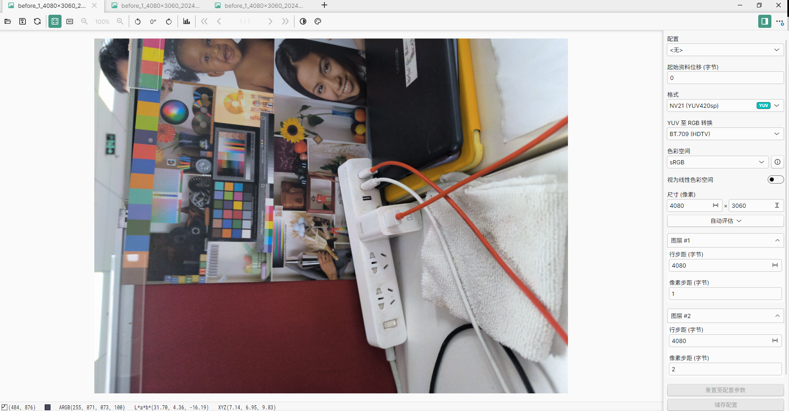

### 广升 Mediatek 平台多帧算法效果调试

该文档能帮助您快速上手广升所有算法的效果调试，并且验证配置是否生效。  
下文将以 hdr 算法的效果调试为例，列出了调试所需的步骤以及需要的环境。  
该文档适用于所有算法效果的调试，如果需要调试其他算法，请将下文看到的所有 hdr 字样替换为对应算法的缩写即可。  
末尾会附上各算法的名称缩写。  

#### 准备：
  1. 宿主机（电脑）上可执行 adb 命令。  
  2. 准备一根数据线。  
  3. 目标机（手机）上刷的是 Userdebug ROM，并且已 remount。

#### 开始调试：

  1. 使用数据线连接宿主机和目标机。
  1. 宿主机执行命令 `adb pull /vendor/media/aducam ./` 将内置的算法配置文件导出。  
  1. 根据需要调试的算法打开对应的 `adu_[算法简称]_cam.ini` 文件，比如需要调试 HDR 则打开 `adu_hdr_cam.ini` 文件。
  1. 根据打开的文件了解各个配置的作用，修改成符合预期的配置文件。  
     文件内容预览

     其中主要关注 **[hdr]** 中的内容，配置 ISO 分段的关键属性为 **iso_array**，在其下面的都为具体的效果参数，请根据其中注释了解各项参数含义。
     其中 **[license]** 和 **[meta]** 请保持不动。  
     
     
     
  1. 宿主机执行命令 `adb push ./aducam /vendor/media/` 将本地的 `aducam` 目录推送到 `/vendor/media` 下。  
     也可以只推送单个文件 `adb push ./aducam/adu_hdr_cam.ini /vendor/media/aducam/`。
  1. 目标机如果在相机界面，请务必按 Home 键回到桌面，再打开相机，让配置生效。
  1. 相机内打开 HDR 拍照，查看成像，如果达不到预期效果，则从第一步开始直到达到预期为止。  
  1. 通过 log 验证配置是否生效：（此处以 HDR 为例）  
     1. 通过工具打开 logcat（建议使用 Android Studio），过滤 tag~:ADU_Uv_HDR。
     1. 目标机通过 HDR 拍照，此时可以看到 logcat 中刷出了 log。
        
        

        可以看到 log 中对应名称属性的值，会按照配置文件中配置的一样。（如果与预期有差异，请与我们联系）

  1. 恭喜您已学会了如何通过配置文件调整算法效果并且验证配置是否生效了。  

### 附

#### 算法配置文件名称对应表  
美颜（fb），人像（portrait），多帧降噪（mfnr），超级夜景（sn），HDR（hdr），AI（classify），滤镜（filter），广角畸变矫正（ldc），文档矫正（dd），全景（pano）

#### 为指定的镜头创建专属配置文件

需求：现有前后微3个镜头都需要 HDR 算法，但是前摄效果不佳，需要单独为前摄制定配置文件。  
按以下步骤操作：  
1. 复制现有的 adu_hdr_cam.ini 文件，将复制后的文件改名为 adu_hdr_cam1.ini。  
1. 将 adu_hdr_cam1.ini 按前摄的需求修改。  
1. 根据上文的方法将新文件 push 到设备中。  

下为配置文件的生效规则：
> 配置文件搜索优先级：  
> adu_[name]_cam[camid].ini > adu_[name]_cam.ini > adu_common_cam[camid].ini > adu_common_cam.ini
> 
> 以下为 HDR 算法的示例  
> adu_hdr_cam0.ini,adu_hdr_cam1.ini, > adu_hdr_cam.ini > adu_common_cam0.ini,adu_common_cam1.ini > adu_common_cam.ini
> 
> 可以发现配置文件的规则为**算法名 + CameraID**的组合，不指定将用默认值代替。
>
Android 系统中，Camera ID 为 0 是后摄，1 是前摄，其他镜头依次递增，比如微距、广角、夜视、长焦等等，会则根据方案商不同而不同，具体需要咨询方案商。  

#### DUMP 原始输入输出图片（YUV NV21）：

  1. 宿主机执行命令打开 dump `adb shell setprop vendor.debug.camera.adu_hdr.dump 1`，执行后务必切换到桌面再进入相机 App 让命令生效。  
  1. HDR 拍照后宿主机执行命令 `adb pull /data/vendor/camera_dump/hdr ./hdr` 将 dump 图导出。
      
     
     

     导出后即可查看图片，其中 before 开头的是从系统中抓取的原始输入图，out 是经过算法合成后的图像。  
     由于是 NV21 格式，需要下载特定工具才能查看。  
     我们推荐使用 PixelViewer [https://carinastudio.azurewebsites.net/PixelViewer/](https://carinastudio.azurewebsites.net/PixelViewer/) 是一款免费开源的原始图像查看器。  
     下载后将导出的文件拖入程序内
     
     

     需要知晓的是，如果看到的图像色彩不对，请按照上方例图正确选择程序内右侧的格式 **（NV21(YUV420sp)）**。  
     如果图像方向不对，这是正常的，因为 Android 出来的原始图像都是横的，后摄图像一般是头朝左，前摄图像一般是头朝右，请勿见怪。  
